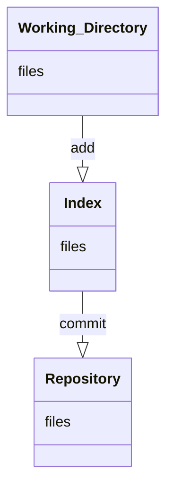

> Bài viết này được tham khảo từ nhiều nguồn. Bạn có thể xem chi tiết ở phần [References](#references) ở cuối bài viết.
{: .prompt-info}

### Tình huống trong cuộc sống

Khi lập trình, sẽ có lúc bạn lỡ tay xóa một đoạn code vì nghĩ rằng đoạn code đó không phù hợp nữa, nhưng sau đó lại phát hiện là đoạn code đó bạn vẫn cần dùng. Bạn nghĩ mình có thể nhớ lại chính xác những gì mình đã viết không? Thực sự rất rất khó. Nhưng nếu bạn có dùng phần mềm quản lý phiên bản mã nguồn thì mọi việc sẽ trở nên đơn giản hơn rất nhiều vì phần mềm quản lý phiên bản mã nguồn sẽ cho phép bạn dễ dàng quay lại một phiên bản trước của tập tin đó. Có thể nói phần mềm quản lý mã nguồn là công cụ không thể thiếu đối với lập trình viên và một trong những phần mềm hỗ trợ quản lý phiên bản rất phổ biến hiện nay là **Git**.

**Git** sẽ giúp người dùng lưu lại các phiên bản của những làn thay đổi mã nguồn để dễ dàng khôi phục lại phiên bản cũ mà không cần phải nhớ là mình đã chỉnh sửa ở đâu, tất cả phiên bản bạn cần đều đã được sao lưu.

**Git** sẽ giúp bạn: 
- Lưu lại được các phiên bản khác nhau của mã nguồn dự án phần mềm
- Khôi phục lại mã nguồn từ một phiên bản bất kỳ
- Dễ dàng so sánh giữa các phiên bản
- Phát hiện được ai đã sửa phần nào làm phát sinh lỗi
- Khôi phục lại tập tin bị mất
- Dễ dàng thử nghiệm, mở rộng tính năng của dự án mà không làm ảnh hưởng đến phiên bản chính (master branch)
- Giúp phối hợp thực hiện dự án trong nhóm một cách hiệu quả

### Git là gì?
**Git** là một hệ thống quản lý phiên bản phân tán (Distributed Version Control System - DVCS) ra đời vào năm 2005 và hiện được dùng rất phổ biến. So với các hệ thống quản lý phiên bản tập trung khi tất cả mã nguồn và lịch sử thay đổi chỉ được lưu một nơi là máy chủ thì trong hệ thống phân tán, các máy khách không chỉ "check out" phiên bản mới nhất của các tệp tin mà là sao chép (mirror) toàn bộ kho mã nguồn (repository). Như vậy, nếu như máy chỉ ngừng hoạt động, thì bạn hoàn toàn có thể lấy kho chứa từ bất kỳ máy khách nào để sao chép ngược trở lại máy chủ để khôi phục lại toàn bộ hệ thống. Mỗi checkout thực sự là một bản sao đầy đủ của tất cả dữ liệu của kho chứa từ máy chủ.

{: .center}

### Các khái niệm cơ bản
#### Repository 
`Repository` là nơi sẽ ghi lại trạng thái của thư mục và file. Trạng thái được lưu lại như là lịch sử thay đổi của nội dung.
`Repository` của `Git` được phân thành 2 loại là `remote repository` và `local repository`

| Repository        | Description                                                                 |
| ----------------- |:--------------------------------------------------------------------------- |
| Remote Repository | Là Repository để chia sẻ giữa nhiều người và bố trí trên server chuyên dụng |
| Local Repository  | Là Repository bố trí trên máy tính của chúng ta                             |

#### Working Tree và Index 
Một thư mục Git được tổ chức như sau:
- Thư mục đang làm việc (`Working Directory`): chứa các tập tin hiện tại.
- Chỉ mục (`Index`) hay `staging area` là nơi chứa các files sẵn sàng để được commit
- `Repository` là nơi chứa các file đã được commit




### Git Flow khi làm việc một mình 

Khi phát triển tính năng cho sản phẩm, ta nên phát triển ở branch riêng để tránh tình trạng branch chính chứa những commit *bẩn*. Sau đây là cách phân chia branch được gợi ý.

* Các branch chính: 
  - Branch Master: Là branch chỉ dùng để theo dõi và đánh tag. Code ở đây là code ổn định nhất và chúng ta không phát triển tính năng trên branch này.
  - Branch Develop: Là branch dùng để  phát triển các tính năng mới cho phiên bản hiện tại. Đây là nhánh mẹ của các nhánh feature. 
  - Branch Release: Là branch được tạo ra khi merge nhánh Develop và nhánh Master. Đây là sản phẩm dành cho người dùng sử dụng.

* Các branch riêng: 
	- Branch feature: Là nhánh được tách ra từ nhánh Develop để phát triển các tính năng mới.
	- Branch bugfix: Là nhánh dùng để fixbug trong quá trình phát triển nhánh Develop 
	- Branch hotfix: Là nhánh dùng để fix các bug quan trọng. Cần phải fix gấp. 

[](https://mermaid.live/edit#pako:eNqdU0FugzAQ_AryOYIALUk5p2rP7ZXLghdsFTAya0QU8feaBCQS0lapT9bszOzsyj6xTHFkMSskvWloRFI79mSqqiRd7qmGOhPOATssVTPVBWZfytANulblCGQ0en3frzlX97uOFeoC1yazuexTUyy8Z49V4T9NH_WoQNZLgyvPKfEHlggter67vVGvK-cejuSxk7Cp6nR-whyCYsQ6S7VkdtVAKLLBb7yvwHvRV80vE6x1U5x3dd7xIssodf05zN_P4_EN3nlcc-zgx20Gv28zWEzgBvM62YbZ_jYMt__iNOoTRgIrTNjI5JiDKWlkDpZqGg6Er1yS0izOoWxxw8CQ-jzWGYtJG5xJBwmFhmoGSwUcrebE6Nhc_mBL1jFTdS6LETe6tLAgatrY88aya_-pMKlr5_FayQVoEt1L5EVBtIcgxGgXwnMY8iz1X_Z58OTnfLf1A2DDMHwDwntG9w)

Mô tả quy trình phát triển của hình trên: 
* Bắt đầu bằng branch **main**
* Checkout ra branch **Develop**
* Để phát triển tính năng mới, ta tạo ra branch **feature/xxx**
* Sau khi đã phát triển xong tính năng, ta merge vào branch **Develop**
* Giả sử ta phát hiện trong branch **Develop** có bug, ta tạo ra một branch **fixbug/xxx** để fix bug chứ không fix bug trực tiếp trên branch **Develop**
* Sau khi đã phát triển được cơ số các tính năng, ta quyết định merge vào branch **main** và release phiên bản hiện tại cho người dùng sử dụng tại branch **Release/1.0** (và đánh tag v1.0.0)
* Sau đó ta checkout trở về branch **Develop** để tiếp tục phát triển những phiên bản tiếp theo. Sau đó làm tương tự những điều trên để release ra phiên bản **Release/2.0**
* Nếu người dùng phát hiện bug trong bản release **Release/1.0**, và yêu cầu chúng ta phải fix lỗi gấp.
  - Ta tạo ra một branch **hotfix** để sửa lỗi 
  - Sau khi sử a lỗi xong thì ta merge vào branch **Release/1.0** và cập nhật phiên bản thành v1.0.1
  - Nếu lỗi đó vẫn còn tồn tại ở branch **Develop** thì ta phải merge branch **hotfix** này vào branch **Develop**
  - Xóa branch **hotfix**

### Git tag là gì?

Git tag là một tính năng giúp ta thuận lợi hơn trong việc tìm lại các phiên bản chạy ổn định giữa rất nhiều các commit. 

Ví dụ:

```bash
git tag <v1.0.0>
```

### Quy định về tên version
Tên version của chúng ta có dạng 

$$ \text{Major.Minor.Patch-BuildID} $$

| Từ khóa | Giải thích                                                           |
| ------- | -------------------------------------------------------------------- |
| Major   | Thay đổi khi bạn thay đổi API **không** còn tương thích với chuẩn cũ |
| Minor   | Thay đổi khi bạn thêm tính năng mới và vẫn tương tích với chuẩn cũ   |
| Patch   | Thay đổi khi bạn fix lỗi                                             |
| BuildID | Ngày commit dạng YYYYMMDD                                            |

### Một số trường hợp hay gặp 

#### Sửa commit cuối cùng 
Để ghi đè lên commit cuối cùng, ta có thể sử dụng lệnh sau
```bash
git commit --amend 
```

#### Xóa commit hiện tại và quay lại commit trước
Lệnh này sẽ xóa tất cả file của commit hiện tại và trở lại commit trước đó. 

```bash
git reset --hard HEAD~1
```
Trong đó *HEAD* là con trỏ chỉ đến commit mà chúng ta đang làm việc.
*HEAD~1* nghĩa là quay trở lại 1 commit trước.

#### Quay trở lại commit trước và vẫn giữ file của commit hiện tại 
Lệnh này sẽ giữ lại tất cả file của commit hiện tại và trở lại commit trước đó.

```bash
git reset --soft HEAD~1
```

#### Tạo branch, chuyển branch, xóa branch

Liệt kê các branch hiện tại
```bash
git branch
```

Chuyển branch
```bash
git checkout <branch name>
```

Tạo branch mới 
```bash
git branch <branch name>
```

Tạo và chuyển sang branch mới (câu lệnh gộp của 2 lệnh trên)
```bash
git checkout -b <branch name>
```

Xóa branch (ta phải thực hiện lệnh này trên branch khác)
```bash
git branch -D <branch name>
```

Quay trở lại commit gần nhất 
```bash
git reset --hard HEAD
```

#### Chỉnh sửa commit cuối cùng trên remote 

Trước hết ta phải sửa commit cuối cùng trên local 
```bash
git commit --amend 
```
Sau đó push lên remote với tùy chọn force để ghi đè lên remote 
```bash
git push --force origin master 
```
hoặc
```bash 
git push -f origin master 
```

#### Xóa branch trên remote 
Ta chuyển sang một branch khác rồi thực hiện lệnh để xóa branch ở remote
```bash
git push origin -d <branch name>
```
Sau đó ta xóa luôn branch ở local 
```bash
git branch -D <branch name>
```

#### Quay lại commit trong quá khứ và phát triển một branch mới 
Trước hết ta liệt kê ra các commit trong quá khứ bằng lệnh 
```bash
$ git log --oneline

Output: 
753aa46 (HEAD -> master, origin/master, origin/HEAD) add Spaceship plugin
6ad8b76 added tony buoi sang: chuyen o trung dong
e796f4f added link to post from about
19632cb changed date of project post
f972998 commented live.html
```
Giả sử ta muốn quay lại commit 19632cb và tạo branch mới tại đó

```bash
git checkout 19632cb -b <new branch>
```

### References
* DEVIOT
* [Trung tâm Tin học Trường Đại học Khoa học Tự nhiên](https://csc.edu.vn/lap-trinh-va-csdl/tin-tuc/kien-thuc-lap-trinh/Git-la-gi--Nhung-khai-niem-co-ban-khi-lam-viec-tren-Git-4133)